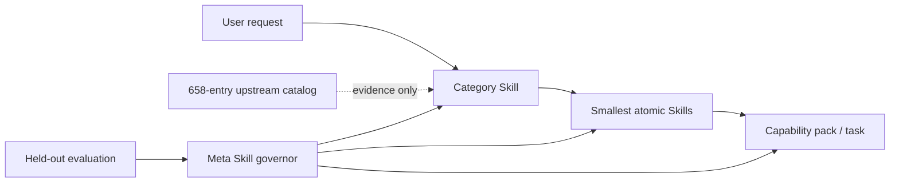

# SkillPack One

[简体中文](README.zh-CN.md) · **Research-grade alpha**

> **The SkillPack is all you need.**
>
> Install one pack. Let it find, combine, and improve the skills you need.

SkillPack One packages the **Self-Organizing Skill System**: a Codex-compatible architecture for atomic, composable, evaluated, and safely self-improving Agent Skills.

"One pack" means one installation and governance entry point—not one giant prompt and not a claim that every possible capability is already bundled. Progressive disclosure keeps the catalog broad while loading only the Category and Atomic Skills required for the current task.

It turns a growing Skill/MCP ecosystem into four deliberately separate layers:



The project does **not** install every discovered capability. The upstream catalog is evidence for classification and decomposition; only reviewed local contracts become executable Skills.

## What is included

| Layer | Current snapshot | Purpose |
| --- | ---: | --- |
| Category Skills | 10 | First-stage, needs-driven routing and boundary decisions |
| Atomic Skills | 11 | Small, independently testable capability contracts |
| Meta Skills | 1 | Proposal, evaluation, promotion, deprecation, and rollback governance |
| Capability packs | 4 | Validated compositions without merging atomic contracts |
| Upstream records | 658 | 388 Agent Skills + 270 official MCP Registry servers |
| Candidate duplicate clusters | 8 | Human-review queue; originals remain intact |

Every category projection carries an English fallback `index.md` plus `index.en.md`, `index.zh-CN.md`, and generic `index.zh.md` variants. English `SKILL.md` remains the portable discovery contract, while localized indexes preserve language-specific terminology and routing habits.

## Core ideas

- **Needs before tools.** Classify the requested outcome, artifact, operation, and constraints before selecting a product or protocol.
- **One primary capability per atom.** Stable capability IDs and explicit inputs, outputs, side effects, permissions, non-goals, and tests make overlap measurable.
- **Progressive disclosure.** Codex sees compact Skill metadata first, then a category index, then only the necessary atomic instructions.
- **Plugin architecture.** The repository is a plugin bundle with a manifest, generated `skills/` projection, project-native `.agents/skills/` projection, schemas, packs, and evaluation assets.
- **Evidence-gated evolution.** A meta Skill may propose its own changes, but cannot weaken its gate in the same proposal. Held-out datasets, permission review, immutable decisions, and rollback pointers remain outside the optimization target.
- **Catalog is not trust.** Collection never executes upstream code. Unknown-license entries are metadata only; installation requires a separate security review.

The design follows the current [OpenAI Agent Skills guidance](https://learn.chatgpt.com/docs/build-skills), [Codex plugin model](https://learn.chatgpt.com/docs/build-plugins), and the [official MCP Registry API](https://github.com/modelcontextprotocol/registry/blob/main/docs/reference/api/official-registry-api.md).

## The philosophy: one pack, many valid implementations

SkillPack One is a reference implementation of a general design philosophy. An individual, community, or organization may choose a different taxonomy, directory layout, evaluation harness, or Meta Skill topology while remaining compatible with the same foundation:

1. **One shared description standard.** Every Skill is a directory with a portable `SKILL.md` containing a discriminating `name` and `description`. This repository additionally requires every first-party Category, Atomic, and Meta Skill to carry the same machine-readable `skill.contract.yaml`: inputs, outputs, outcome, artifacts, boundaries, permissions, side effects, provenance, routing signals, and evaluations.
2. **Categories index Skills progressively.** A request first selects a Category Skill, then reads that category's `index.md` or locale-specific index, and only then loads the selected Atom. Category trees should stay shallow: no more than three Category levels is recommended—broad domain → subdomain → specific category → Atomic Skill. The Atom is the leaf and is not counted as a Category level. This implementation keeps executable Skill directories flat for Codex discovery while representing hierarchy through taxonomy parents and generated indexes; another host may use physical nested directories.
3. **Every Skill may be generated, trained, and evolved.** A Skill may be authored by a person, recorded from a workflow, or drafted with `@skill-creator` in ChatGPT and `$skill-creator` in Codex. Here, "training" means improving descriptions, contracts, instructions, and compositions against versioned routing and task suites—not silently changing model weights. Meta Skills govern proposals, evaluation, promotion, deprecation, and rollback. They may govern the whole pack, one Category subtree, or one specific Skill, including themselves under the same gate.
4. **Atoms have explicit responsibility boundaries.** An Atomic Skill owns one primary outcome, one dominant artifact or state transition, one permission envelope, one focused rubric, and an independently useful failure boundary. Broad end-to-end workflows belong in capability packs that compose atoms without merging them.
5. **The foundation is shared; the taxonomy is not universal.** Different maintainers may split industries, functions, modalities, and risk domains differently. Conformance comes from portable descriptions, explicit boundaries, progressive indexes, evidence, and governed evolution—not from copying this repository's ten top-level categories.

See the [classification standard](taxonomy/classification-standard.md), [evaluation policy](docs/evaluation.md), and [evolution policy](docs/evolution-policy.md) for this implementation's concrete profile.

## Community and model contributions

Communities and models may propose new Skills or improvements, but generation is not approval. Each contribution follows the same admission path:

1. Submit provenance, license state, the shared contract, localized routing examples, permissions, and evaluation cases.
2. Use model-assisted classification and similarity analysis to choose the narrowest category, extract the atomic responsibility, and identify overlap with existing Skills.
3. Review security, authority, provenance, and duplicate candidates. A generating model must not be the sole approver of its own change; use an independent reviewer, a maintainer, or both according to risk.
4. Regenerate parent/child indexes and run development, held-out, multilingual, adversarial, and task-completion suites as applicable.
5. Promote only through an append-only decision with a rollback pointer. Merge with an existing Atom, reject, or deprecate when a proposal adds wording but no distinct reusable capability.

This keeps community growth additive in useful capability rather than additive in duplicated context. See [CONTRIBUTING.md](CONTRIBUTING.md) for the review checklist.

## Quick start

Requirements: Node.js 24 or newer and Git.

```sh
git clone https://github.com/WnagoiYy/skillpack-one.git
cd skillpack-one
npm ci
npm run ci
```

Try the explainable router:

```sh
npm run skillpack -- route "请调研三家竞争对手并输出带引用的中文报告"
npm run skillpack -- catalog stats
npm run skillpack -- packs
npm run skillpack -- harness status
npm run skillpack -- harness discover --adapter pi
```

For a Codex project-native installation, copy the reviewed directories under `.agents/skills/` into the target repository's `.agents/skills/`. The same generated Skills are available under `skills/` for the plugin bundle and compatible harnesses. Canonical sources live in `skill-src/`; do not edit either projection directly.

## Repository map

```text
.codex-plugin/        Codex plugin manifest
.agents/skills/       generated project-native projection
skills/               generated plugin/harness projection
skill-src/            canonical category, atomic, and meta Skills
taxonomy/             classification standard and boundaries
catalog/              attributed, non-executed upstream metadata
packs/                composable capability packages
schemas/              machine-readable contracts
evals/                split datasets, gates, and baselines
.skill-system/        evolution proposals and immutable decisions
src/                  router, validator, catalog, evaluator, trainer, harnesses
```

## Evaluation and real evolution evidence

`npm run skillpack -- gate` evaluates routing without collapsing metrics: category hit@1/@3, atom hit@1/@3, atom MRR, non-invocation accuracy, and safety pass rate. English, Chinese, and adversarial suites are separate. Task completion uses a different rubric and cannot be inferred from routing accuracy.

The repository includes one real governed evolution record: `proposal-generic-zh-fallback`. The candidate added `index.zh.md`, passed isolated development plus untouched English, Chinese, and adversarial suites, and produced an append-only promotion decision with a rollback revision.

New candidates can be bound to their exact canonical Git diff with `npm run skillpack -- train propose --id <id> --target <skill-id> --observation <evidence>`, then evaluated and promoted through the immutable decision log. Protected datasets, baselines, and the release gate cannot certify a candidate that changes them.

Pi 0.84.4 is pinned and its real `loadSkillsFromDir` implementation discovers all 22 Skills. Model-backed task completion remains explicitly **uncertified** until Pi provider credentials are configured. The deterministic Mock adapter tests protocol plumbing only and is always marked `synthetic: true`; the optional DeepSeek Harness adapter stays disabled until a compatible CLI release is pinned.

See [evaluation](docs/evaluation.md), [harnesses](docs/harnesses.md), and the [evolution policy](docs/evolution-policy.md).

## Refreshing the research catalog

```sh
npm run skillpack -- catalog collect
npm run skillpack -- catalog deduplicate
npm run skillpack -- catalog stats
```

Collection uses fixed Git revisions and the read-only official MCP Registry endpoint, records attribution and fingerprints, and does not execute packages, hooks, endpoints, or Skill instructions. Review [catalog methodology](docs/catalog-methodology.md) and [third-party notices](THIRD_PARTY.md) before changing sources.

The machine-readable [`catalog/decomposition-map.yaml`](catalog/decomposition-map.yaml) shows how representative upstream patterns informed each local Atom, the Meta Skill, and all four packs without copying or activating upstream implementations.

## Roadmap

- Grow held-out multilingual routing and executable task suites from real failures.
- Add semantic duplicate review without turning similarity into automatic deletion.
- Certify live Pi task-completion baselines across pinned model/provider pairs.
- Pin and implement a compatible DeepSeek Harness adapter.
- Add signed snapshots, trust promotions, canary releases, and richer rollback telemetry.

Contributions are welcome through [CONTRIBUTING.md](CONTRIBUTING.md). Security issues follow [SECURITY.md](SECURITY.md). Licensed under Apache-2.0.
