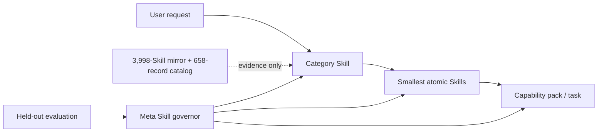

# SkillPack One

[简体中文](README.zh-CN.md) · **Research-grade alpha**

> **The SkillPack is all you need.**
>
> Install one pack. Let it find, combine, and improve the skills you need.

SkillPack One packages the **Self-Organizing Skill System**: a Codex-compatible architecture for atomic, composable, evaluated, and safely self-improving Agent Skills.

"One pack" means one installation and governance entry point—not one giant prompt and not a claim that every possible capability is already bundled. Progressive disclosure keeps the catalog broad while loading only the Category and Atomic Skills required for the current task.

It turns a growing Skill/MCP ecosystem into four deliberately separate layers:



The project does **not** install every discovered capability. The upstream catalog is evidence for classification and decomposition; only reviewed local contracts become executable Skills.

## What is included

| Layer | Current snapshot | Purpose |
| --- | ---: | --- |
| Category Skills | 22 | Open, hierarchical, needs-driven routing and boundary decisions |
| Atomic Skills | 76 | Small, independently testable capability contracts |
| Meta Skills | 8 | Separate curation, authoring, audit, evaluation, optimization, migration, composition, and lifecycle governance roles |
| Capability packs | 4 | Validated compositions without merging atomic contracts |
| Downloaded Skill inventory | 3,998 | 3,973 unique contents from 40 non-empty repositories; 25 exact duplicates are marked |
| General upstream catalog | 658 | 388 Agent Skills + 270 official MCP Registry servers |
| Candidate duplicate clusters | 8 | Human-review queue; originals remain intact |

Every category projection carries an English fallback `index.md` plus `index.en.md`, `index.zh-CN.md`, and generic `index.zh.md` variants. English `SKILL.md` remains the portable discovery contract, while localized indexes preserve language-specific terminology and routing habits.

## Core ideas

- **Needs before tools.** Classify the requested outcome, artifact, operation, and constraints before selecting a product or protocol.
- **One primary capability per atom.** Stable capability IDs and explicit inputs, outputs, side effects, permissions, non-goals, and tests make overlap measurable.
- **Compose explicitly.** Multi-step requests select reviewed Capability Packs whose stable Skill subset, count, dependency order, and acceptance tests compile into an explainable DAG.
- **Bound current state where safe.** Long-running packs may opt into a schema-validated current-state profile while keeping immutable audit history outside the active prompt. Transcript mode remains valid when history cannot be safely summarized as state.
- **Progressive disclosure.** Codex sees compact Skill metadata first, then a category index, then only the necessary atomic instructions.
- **Typed relations, not an ungoverned graph.** Reviewed contracts and packs materialize `confusable-with`, `compose-with`, `depends-on`, and `packaged-in` edges. Similarity may suggest review, but cannot authorize installation, merging, execution, or deletion.
- **Plugin architecture.** The repository is a plugin bundle with a manifest, generated `skills/` projection, project-native `.agents/skills/` projection, schemas, packs, and evaluation assets.
- **Evidence-gated evolution.** A meta Skill may propose its own changes, but cannot weaken its gate in the same proposal. Held-out datasets, permission review, immutable decisions, and rollback pointers remain outside the optimization target.
- **Lifecycle security.** Authoring, storage, retrieval, selection, execution, and evolution are separate trust boundaries. Passing one stage never substitutes for evidence at another.
- **Persistent evolution knowledge.** Raw runs, consolidated patterns, and active Skills remain separate. Meta governance may reuse indexed evidence across iterations, while normal task execution sees only promoted Skills.
- **Catalog is not trust.** Collection never executes upstream code. Unknown-license entries are metadata only; installation requires a separate security review.
- **Skill lift, not Skill presence.** A Skill is useful only when a matched with-Skill run improves over the no-Skill baseline without protected regressions; synthetic protocol tests cannot certify that claim.

The design follows the current [OpenAI Agent Skills guidance](https://learn.chatgpt.com/docs/build-skills), [Codex plugin model](https://learn.chatgpt.com/docs/build-plugins), and the [official MCP Registry API](https://github.com/modelcontextprotocol/registry/blob/main/docs/reference/api/official-registry-api.md).

## The philosophy: one pack, many valid implementations

SkillPack One is a reference implementation of a general design philosophy. An individual, community, or organization may choose a different taxonomy, directory layout, evaluation harness, or Meta Skill topology while remaining compatible with the same foundation:

1. **One shared description standard.** Every Skill is a directory with a portable `SKILL.md` containing a discriminating `name` and `description`. This repository additionally requires every first-party Category, Atomic, and Meta Skill to carry the same machine-readable `skill.contract.yaml`: inputs, outputs, outcome, artifacts, boundaries, permissions, side effects, provenance, routing signals, and evaluations.
2. **Categories index Skills progressively.** A request first selects a Category Skill, then reads that category's `index.md` or locale-specific index, and only then loads the selected Atom. Category trees should stay shallow: no more than three Category levels is recommended—broad domain → subdomain → specific category → Atomic Skill. The Atom is the leaf and is not counted as a Category level. This implementation keeps executable Skill directories flat for Codex discovery while representing hierarchy through taxonomy parents and generated indexes; another host may use physical nested directories.
3. **Every Skill may be generated, trained, and evolved.** A Skill may be authored by a person, recorded from a workflow, or drafted with `@skill-creator` in ChatGPT and `$skill-creator` in Codex. Here, "training" means improving descriptions, contracts, instructions, and compositions against versioned routing and task suites—not silently changing model weights. Eight bounded Meta Skills separate upstream curation, authoring, read-only audit, behavioral evaluation, bounded optimization, host migration, pack composition, and final lifecycle governance. They may govern the whole pack, one Category subtree, or one specific Skill, including themselves under the same gate.
4. **Atoms have explicit responsibility boundaries.** An Atomic Skill owns one primary outcome, one dominant artifact or state transition, one permission envelope, one focused rubric, and an independently useful failure boundary. Broad end-to-end workflows belong in capability packs that compose atoms without merging them.
5. **The foundation is shared; the taxonomy is open.** Problem solving, scientific research, software development, and software use are seed examples, not an exhaustive four-way split. This reference implementation also retains business, data, documents, design/media, automation/operations, personal productivity, security/trust, and Skill/Agent governance. Different maintainers may add or split industries, functions, modalities, and risk domains. Conformance comes from portable descriptions, explicit boundaries, progressive indexes, evidence, and governed evolution—not from copying one fixed category list.

See the [classification standard](taxonomy/classification-standard.md), [evaluation policy](docs/evaluation.md), and [evolution policy](docs/evolution-policy.md) for this implementation's concrete profile.

## Community and model contributions

Communities and models may propose new Skills or improvements, but generation is not approval. Each contribution follows the same admission path:

1. Submit provenance, license state, the shared contract, localized routing examples, permissions, and evaluation cases.
2. Use model-assisted classification and similarity analysis to choose the narrowest category, extract the atomic responsibility, and identify overlap with existing Skills.
3. Review security, authority, provenance, and duplicate candidates. A generating model must not be the sole approver of its own change; use an independent reviewer, a maintainer, or both according to risk.
4. Regenerate parent/child indexes and run development, held-out, multilingual, adversarial, and task-completion suites as applicable.
5. Promote only through an append-only decision with a rollback pointer. Merge with an existing Atom, reject, or deprecate when a proposal adds wording but no distinct reusable capability.

This keeps community growth additive in useful capability rather than additive in duplicated context. See [CONTRIBUTING.md](CONTRIBUTING.md) for the review checklist.

## Quick start

Requirements: Node.js 24 or newer and Git. To install the published prerelease and project-native Codex Skills:

```sh
npm install --global skillpack-one@next
cd your-codex-project
skillpack install
skillpack route "Design a reproducible scientific study"
```

`skillpack install` copies the complete reviewed projection into the current project's `.agents/skills/`. It is idempotent and refuses to overwrite conflicting user-owned Skill directories unless `--force` is explicit.

For repository development:

```sh
git clone https://github.com/WnagoiYy/skillpack-one.git
cd skillpack-one
npm ci
npm run ci
```

Launch the generated Skill Browser to search the current taxonomy and inspect each canonical contract and `SKILL.md`:

```sh
npm run web:serve
```

Then open `http://127.0.0.1:4173`. The static data snapshot is rebuilt from `skill-src/` and `taxonomy/` each time; categories are discovered from the open taxonomy rather than hard-coded.

Try the explainable router:

```sh
npm run skillpack -- route "请调研三家竞争对手并输出带引用的中文报告"
npm run skillpack -- compose "Plan, implement, and security-review a bounded code change"
npm run skillpack -- catalog stats
npm run skillpack -- packs
npm run skillpack -- relations
npm run skillpack -- state init safe-skill-evolution
npm run skillpack -- security check path/to/lifecycle-review.yaml
npm run skillpack -- train attempt path/to/evolution-attempt.yaml
npm run skillpack -- harness status
npm run skillpack -- harness discover --adapter pi
```

For a Codex project-native installation, copy the reviewed directories under `.agents/skills/` into the target repository's `.agents/skills/`. The same generated Skills are available under `skills/` for the plugin bundle and compatible harnesses. Canonical sources live in `skill-src/`; do not edit either projection directly.

## npm releases

Permanent releases use GitHub Actions and npm Trusted Publishing (OIDC), without a long-lived repository write token. Exact tag/version matching, `main` ancestry, the complete CI gate, an `npm` deployment Environment, package inspection, and `next`/`latest` separation are enforced before publication. Because npm requires a package to exist before OIDC trust can be configured, maintainers must perform one 2FA-authenticated bootstrap publish first. Follow the complete [npm release and rollback guide](docs/npm-release.md).

## Repository map

```text
.codex-plugin/        Codex plugin manifest
.agents/skills/       generated project-native projection
skills/               generated plugin/harness projection
skill-src/            canonical category, atomic, and meta Skills
taxonomy/             classification standard and boundaries
catalog/              attributed, non-executed upstream metadata
packs/                composable capability packages
runtime/              optional pack-specific state schemas and initial states
schemas/              machine-readable contracts
evals/                split datasets, gates, and baselines
paper/                English paper draft, Chinese extended abstract, bibliography
.skill-system/        evolution proposals and immutable decisions
  knowledge/          non-executable, indexed evolution patterns
src/                  router, validator, catalog, evaluator, trainer, harnesses
web/                  light static Skill Browser source
.openai/hosting.json  static hosting configuration
```

## Evaluation and real evolution evidence

`npm run skillpack -- gate` evaluates routing without collapsing metrics: category hit@1/@3, atom hit@1/@3, atom MRR, equivalence-aware atom Recall@3 and Full Coverage@3, special Meta Skill hit@1/@3 and MRR, non-invocation accuracy, and safety pass rate. Multi-Atom requests pass Full Coverage only when every required capability group appears. English, Chinese, Meta, adversarial, and same-domain hard-distractor suites are separate. The current 202 routing examples all pass; this verifies repository conformance, not general model utility. Task completion uses a different rubric and cannot be inferred from routing accuracy. `skillpack harness effect <without.json> <with.json>` then measures paired completion/rubric lift under the same dataset and harness identity.

The repository includes one real governed evolution record: `proposal-generic-zh-fallback`. The candidate added `index.zh.md`, passed isolated development plus untouched English, Chinese, and adversarial suites, and produced an append-only promotion decision with a rollback revision.

New candidates can be bound to their exact canonical Git diff with `npm run skillpack -- train propose --id <id> --target <skill-id> --observation <evidence> --author <identity> --authorship <human|model-assisted|model-generated> [--generator <model>]`, then evaluated and independently promoted through the immutable decision log. Individual optimizer steps can be recorded with bounded `add`, `delete`, or `replace` edits; ties, protected regressions, over-budget attempts, and declared decisions inconsistent with measurements fail closed. Protected datasets, baselines, and the release gate cannot certify a candidate that changes them.

Pi 0.84.4 is pinned and its real `loadSkillsFromDir` implementation discovers all 106 Skills. The repository now carries 202 routing examples across original, English, Chinese, Meta, same-domain distractor, and adversarial suites; all pass the deterministic routing gate. Model-backed task completion remains explicitly **uncertified** until Pi provider credentials are configured. The deterministic Mock adapter tests protocol plumbing only and is always marked `synthetic: true`; the optional DeepSeek Harness adapter stays disabled until a compatible CLI release is pinned.

See [evaluation](docs/evaluation.md), [harnesses](docs/harnesses.md), and the [evolution policy](docs/evolution-policy.md).

The [Evolution Knowledge policy](docs/evolution-knowledge.md) explains how recurring successes, failures, rejected proposals, and research evidence become scoped, traceable patterns without becoming hidden task instructions.

## Refreshing the open research catalog

```sh
npm run skillpack -- catalog collect
npm run skillpack -- catalog mirror-skills --refresh
npm run skillpack -- catalog deduplicate
npm run skillpack -- catalog stats
```

`catalog mirror-skills` shallow-downloads declared Git repositories into ignored local cache, reads `SKILL.md` metadata through Git objects, fingerprints exact content, marks duplicates, applies an extensible first-pass taxonomy, and writes the committed inventory. It never executes upstream packages, hooks, scripts, endpoints, or Skill instructions. Unknown-license material remains design evidence only. The current automatic families are not a closed ontology: unmatched capabilities enter a manual-review queue, and maintainers may add new taxonomy nodes under the same contract and evaluation rules. Review [catalog methodology](docs/catalog-methodology.md) and [third-party notices](THIRD_PARTY.md) before changing sources.

The machine-readable [`catalog/decomposition-map.yaml`](catalog/decomposition-map.yaml) shows how representative upstream patterns informed each local Atom, Meta Skill, and all four packs without copying or activating upstream implementations.

## Research basis and boundaries

The [Agent Skill literature review](docs/research/2026-09-02-agent-skill-literature.md) maps evidence from SkillsBench, Skill-Inject, compositional routing, structured composition, retrieval, and self-evolving Skill work to adopted, deferred, and rejected changes. The focused [WikiSkill and SKILL.state analysis](docs/research/2026-09-02-wikiskill-skill-state.md) explains why persistent cross-iteration knowledge belongs under Meta governance while bounded within-run state belongs to Capability Pack execution. The subsequent [retrieval, security, and optimization synthesis](docs/research/2026-09-02-retrieval-security-optimization.md) maps SkillRet, SkillRouter, realistic Skill-use evaluation, Agent Skill Security, SkillNet, and SkillOpt into implemented controls and deferred experiments. The [Skill Creator landscape](docs/research/2026-09-03-meta-skill-creator-landscape.md) explains why creation, audit, evaluation, optimization, migration, composition, curation, and final governance are eight separate Meta responsibilities. Research may improve retrieval, composition, verification, execution, and learning loops, but it does not replace the Category → Atom → Capability Pack → Meta architecture.

The resulting system argument is available as the conference-style paper draft [SkillPack One: A Portable Control Plane for Self-Organizing, Composable, and Governed Agent Skills](paper/skillpack-one.md), with a [Chinese extended abstract](paper/skillpack-one.zh-CN.md) and [BibTeX bibliography](paper/references.bib). Numerical results in the draft are deliberately limited to reproducible repository conformance; the model-backed experiments are presented as future protocol, not completed evidence.

## Roadmap

- Grow held-out multilingual routing and executable task suites from real failures.
- Compare deterministic, sparse/dense hybrid, distilled-metadata, and body-aware retrieval without changing the portable control-plane contract.
- Build protected compositional datasets and certify paired live Skill lift across pinned harness/model pairs.
- Add semantic duplicate review without turning similarity into automatic deletion.
- Certify live Pi task-completion baselines across pinned model/provider pairs.
- Pin and implement a compatible DeepSeek Harness adapter.
- Add signed snapshots, trust promotions, canary releases, and richer rollback telemetry.

Contributions are welcome through [CONTRIBUTING.md](CONTRIBUTING.md). Security issues follow [SECURITY.md](SECURITY.md). Licensed under Apache-2.0.
