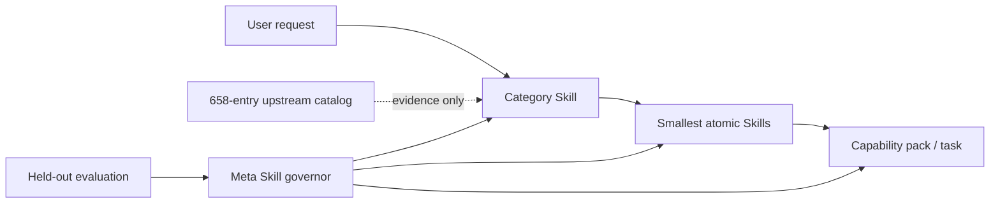

# Self-Organizing Skills

[简体中文](README.zh-CN.md) · **Research-grade alpha**

A Codex-compatible operating system for atomic, composable, evaluated, and safely self-improving Agent Skills.

It turns a growing Skill/MCP ecosystem into four deliberately separate layers:



The project does **not** install every discovered capability. The upstream catalog is evidence for classification and decomposition; only reviewed local contracts become executable Skills.

## What is included

| Layer | Current snapshot | Purpose |
| --- | ---: | --- |
| Category Skills | 10 | First-stage, needs-driven routing and boundary decisions |
| Atomic Skills | 11 | Small, independently testable capability contracts |
| Meta Skills | 1 | Proposal, evaluation, promotion, deprecation, and rollback governance |
| Capability packs | 4 | Validated compositions without merging atomic contracts |
| Upstream records | 658 | 388 Agent Skills + 270 official MCP Registry servers |
| Candidate duplicate clusters | 8 | Human-review queue; originals remain intact |

Every category projection carries `index.en.md`, `index.zh-CN.md`, and generic `index.zh.md` indexes. English `SKILL.md` remains the portable discovery contract, while localized indexes preserve language-specific terminology and routing habits.

## Core ideas

- **Needs before tools.** Classify the requested outcome, artifact, operation, and constraints before selecting a product or protocol.
- **One primary capability per atom.** Stable capability IDs and explicit inputs, outputs, side effects, permissions, non-goals, and tests make overlap measurable.
- **Progressive disclosure.** Codex sees compact Skill metadata first, then a category index, then only the necessary atomic instructions.
- **Plugin architecture.** The repository is a plugin bundle with a manifest, generated `skills/` projection, project-native `.agents/skills/` projection, schemas, packs, and evaluation assets.
- **Evidence-gated evolution.** A meta Skill may propose its own changes, but cannot weaken its gate in the same proposal. Held-out datasets, permission review, immutable decisions, and rollback pointers remain outside the optimization target.
- **Catalog is not trust.** Collection never executes upstream code. Unknown-license entries are metadata only; installation requires a separate security review.

The design follows the current [OpenAI Agent Skills guidance](https://learn.chatgpt.com/docs/build-skills), [Codex plugin model](https://learn.chatgpt.com/docs/build-plugins), and the [official MCP Registry API](https://github.com/modelcontextprotocol/registry/blob/main/docs/reference/api/official-registry-api.md).

## Quick start

Requirements: Node.js 24 or newer and Git.

```sh
git clone https://github.com/WnagoiYy/self-organizing-skills.git
cd self-organizing-skills
npm ci
npm run ci
```

Try the explainable router:

```sh
npm run sos -- route "请调研三家竞争对手并输出带引用的中文报告"
npm run sos -- catalog stats
npm run sos -- packs
npm run sos -- harness status
```

For a Codex project-native installation, copy the reviewed directories under `.agents/skills/` into the target repository's `.agents/skills/`. The same generated Skills are available under `skills/` for the plugin bundle and compatible harnesses. Canonical sources live in `skill-src/`; do not edit either projection directly.

## Repository map

```text
.codex-plugin/        Codex plugin manifest
.agents/skills/       generated project-native projection
skills/               generated plugin/harness projection
skill-src/            canonical category, atomic, and meta Skills
taxonomy/             classification standard and boundaries
catalog/              attributed, non-executed upstream metadata
packs/                composable capability packages
schemas/              machine-readable contracts
evals/                split datasets, gates, and baselines
.skill-system/        evolution proposals and immutable decisions
src/                  router, validator, catalog, evaluator, trainer, harnesses
```

## Evaluation and real evolution evidence

`npm run sos -- gate` evaluates routing without collapsing metrics: category hit@1/@3, atom hit@1/@3, atom MRR, non-invocation accuracy, and safety pass rate. English, Chinese, and adversarial suites are separate. Task completion uses a different rubric and cannot be inferred from routing accuracy.

The repository includes one real governed evolution record: `proposal-generic-zh-fallback`. The candidate added `index.zh.md`, passed isolated development plus untouched English, Chinese, and adversarial suites, and produced an append-only promotion decision with a rollback revision.

Pi 0.84.4 is pinned and its real `loadSkillsFromDir` implementation discovers all 22 Skills. Model-backed task completion remains explicitly **uncertified** until Pi provider credentials are configured. The deterministic Mock adapter tests protocol plumbing only and is always marked `synthetic: true`; the optional DeepSeek Harness adapter stays disabled until a compatible CLI release is pinned.

See [evaluation](docs/evaluation.md), [harnesses](docs/harnesses.md), and the [evolution policy](docs/evolution-policy.md).

## Refreshing the research catalog

```sh
npm run sos -- catalog collect
npm run sos -- catalog deduplicate
npm run sos -- catalog stats
```

Collection uses fixed Git revisions and the read-only official MCP Registry endpoint, records attribution and fingerprints, and does not execute packages, hooks, endpoints, or Skill instructions. Review [catalog methodology](docs/catalog-methodology.md) and [third-party notices](THIRD_PARTY.md) before changing sources.

## Roadmap

- Grow held-out multilingual routing and executable task suites from real failures.
- Add semantic duplicate review without turning similarity into automatic deletion.
- Certify live Pi task-completion baselines across pinned model/provider pairs.
- Pin and implement a compatible DeepSeek Harness adapter.
- Add signed snapshots, trust promotions, canary releases, and richer rollback telemetry.

Contributions are welcome through [CONTRIBUTING.md](CONTRIBUTING.md). Security issues follow [SECURITY.md](SECURITY.md). Licensed under Apache-2.0.
