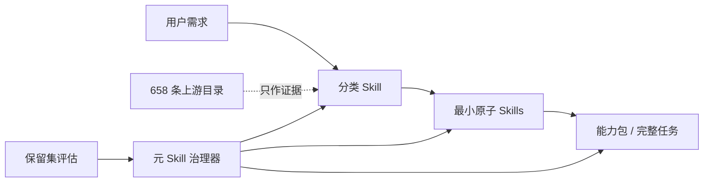

# SkillPack One

[English](README.md) · **研究型 Alpha 版本**

> **The SkillPack is all you need.**
>
> 只装一个包，让它自动寻找、组合和进化你需要的技能。

SkillPack One 对外提供一个安装包，内部技术架构称为 **Self-Organizing Skill System**：一个兼容 Codex 的原子化、可组合、可评估、可安全自进化的 Agent Skill 系统。

“一个包”指一个统一的安装与治理入口，不是把所有指令塞进一个巨大 Prompt，也不宣称当前已经包含世上所有能力。系统通过渐进式读取保留广阔目录，但每次任务只加载命中的分类 Skill 和原子 Skill。

它没有把网上所有 Skill 一股脑安装进上下文，而是把生态分成四层：



上游目录只为分类、拆分和组合提供证据；只有经过本仓库审查并声明能力契约的内容，才进入可执行 Skill 层。

## 首版包含什么

| 层级 | 当前数量 | 作用 |
| --- | ---: | --- |
| 分类 Skills | 10 | 第一阶段按真实需求分类，并处理领域边界 |
| 原子 Skills | 11 | 小而独立、可测试、可替换的能力契约 |
| 元 Skills | 1 | 管理提案、评估、晋级、弃用与回滚，也约束自身 |
| 能力包 | 4 | 不合并原子的前提下，组成端到端任务 |
| 上游记录 | 658 | 388 个 Agent Skills + 270 个官方 MCP Registry 服务 |
| 疑似重复簇 | 8 | 进入人工审查队列，不自动删除来源 |

每个分类投影同时提供英文回退 `index.md`、`index.en.md`、`index.zh-CN.md` 和通用中文回退 `index.zh.md`。英文 `SKILL.md` 保持跨工具发现兼容性，本地化索引则保留不同语言的表达和路由习惯。

## 我采纳并固化的设计原则

- **先需求、后工具。** 先判断目标结果、产物、操作和约束，再选择具体产品或协议。
- **一个原子一个主要能力。** 稳定能力 ID，加上输入、输出、副作用、权限、非目标和测试，使重叠可计算、可审查。
- **显式组合。** 多步骤请求只选择经过审查的能力包，把稳定 Skill 子集、数量、依赖顺序和验收测试编译成可解释 DAG。
- **渐进式读取。** Codex 先看到精简元数据，再命中分类索引，最后只加载完成任务所需的原子 Skill。
- **插件式架构。** 仓库本身是一个插件包，包含清单、两种 Skill 投影、Schema、能力包和评估资产。
- **证据门禁下的进化。** 元 Skill 可以修改自己，但不能在同一个提案中削弱自己的门禁；保留测试集、权限审批、追加式决策记录和回滚指针不受优化目标控制。
- **被收录不等于可信。** 采集过程不执行上游代码；许可未知的条目只保存元数据，安装前必须另行安全审查。
- **看 Skill Lift，不看“有没有 Skill”。** 只有在相同任务上优于无 Skill 基线且受保护指标不退化，才能证明 Skill 有用；Synthetic 协议测试不能认证该结论。

架构参考当前的 [OpenAI Agent Skills 文档](https://learn.chatgpt.com/docs/build-skills)、[Codex 插件文档](https://learn.chatgpt.com/docs/build-plugins)和[官方 MCP Registry API](https://github.com/modelcontextprotocol/registry/blob/main/docs/reference/api/official-registry-api.md)。

## 设计哲学：只装一个包，但允许多种实现

SkillPack One 是一套通用设计哲学的参考实现。个人、社区和组织可以采用不同的分类体系、目录结构、评测 Harness 或元 Skill 拓扑，只要遵循共同基础：

1. **所有 Skill 使用同一套描述规范。** 每个 Skill 都是一个目录，并包含可移植的 `SKILL.md`，其中 `name` 与 `description` 必须能准确区分触发范围。本仓库进一步要求每个第一方分类、原子和元 Skill 使用同一份机器可读 `skill.contract.yaml`，声明输入、输出、结果、产物、边界、权限、副作用、来源、路由信号和评测。
2. **分类 Skill 负责渐进式索引。** 请求先命中分类 Skill，再读取该层级的 `index.md` 或对应语言索引，最后才加载选中的原子 Skill。分类树建议最多三层：行业或领域大类 → 细分领域 → 具体分类 → 原子 Skill；原子 Skill 是叶节点，不计入分类层数。本实现为了兼容 Codex 发现机制，保持可执行 Skill 目录扁平，通过 taxonomy 的父子关系和生成索引表达逻辑层级；其他宿主也可以采用物理嵌套目录。
3. **所有 Skill 都可以生成、训练和进化。** Skill 可以由人编写、从工作流录制，或在 ChatGPT 中通过 `@skill-creator`、在 Codex 中通过 `$skill-creator` 生成草案。这里的“训练”是依据版本化路由题集和任务题集，持续优化描述、契约、指令与组合，不是静默修改模型权重。元 Skill 负责提案、评测、晋级、弃用和回滚；它既可以管理整个包，也可以只管理某个分类子树或单个 Skill，并以同一门禁约束自身。
4. **原子 Skill 的职责边界必须明确。** 一个原子 Skill 只拥有一个主要结果、一个主导产物或状态变化、一个权限包络、一个聚焦评分标准和一个可独立复用的失败边界。端到端流程应通过能力包组合原子能力，而不是重新把多个原子揉成巨型 Skill。
5. **基础规范通用，具体分类并不唯一。** 不同维护者可以按行业、职能、模态或风险采用不同划分。是否符合这套哲学，取决于描述可移植、边界明确、索引渐进、证据可查和进化受治理，而不是照搬本仓库现有的十个一级分类。

本实现的具体规则见[分类标准](taxonomy/classification-standard.zh-CN.md)、[评估流程](docs/zh-CN/evaluation.md)和[进化策略](docs/zh-CN/evolution-policy.md)。

## 社区与大模型贡献

社区和大模型都可以提出新 Skill 或改进方案，但“生成”不等于“审核通过”。每项贡献采用同一准入流程：

1. 提交来源、许可证状态、统一能力契约、多语言路由样例、权限声明和评测案例。
2. 使用大模型辅助分类与相似度分析，选择最窄的分类、提取原子职责，并找出与现有 Skill 的重叠。
3. 审核安全、权限、来源和重复候选。生成变更的模型不能成为唯一审核者；应根据风险使用独立模型、维护者或两者共同审核。
4. 重新生成父子分类索引，并按需要运行开发集、留出集、多语言集、对抗集和任务完成集。
5. 只有生成不可覆盖的晋级决策和回滚指针后才能合入；若提案只增加表述、没有新的可复用能力，则应与现有 Atom 合并、拒绝或弃用。

这样，社区增长增加的是有效能力，而不是重复上下文。详细清单见 [CONTRIBUTING.md](CONTRIBUTING.md)。

## 快速开始

需要 Node.js 24 或更新版本，以及 Git。

```sh
git clone https://github.com/WnagoiYy/skillpack-one.git
cd skillpack-one
npm ci
npm run ci
```

体验可解释路由和状态检查：

```sh
npm run skillpack -- route "请调研三家竞争对手并输出带引用的中文报告"
npm run skillpack -- compose "规划、实现并安全审查一个边界明确的代码修改"
npm run skillpack -- catalog stats
npm run skillpack -- packs
npm run skillpack -- harness status
npm run skillpack -- harness discover --adapter pi
```

若要以 Codex 项目级 Skill 使用，请把本仓库 `.agents/skills/` 下经过审查的目录复制到目标仓库的 `.agents/skills/`。插件包和兼容 Harness 使用 `skills/`。二者都由 `skill-src/` 生成，请勿直接编辑投影目录。

## 目录结构

```text
.codex-plugin/        Codex 插件清单
.agents/skills/       生成的 Codex 项目级投影
skills/               生成的插件/Harness 投影
skill-src/            分类、原子与元 Skill 的唯一源文件
taxonomy/             分类标准与边界
catalog/              有来源、未执行的上游元数据
packs/                可组合能力包
schemas/              机器可读能力契约
evals/                分集问题集、门槛与基线
.skill-system/        进化提案与追加式决策记录
src/                  路由、校验、采集、评估、训练和 Harness
```

## 测试与真实进化证据

`npm run skillpack -- gate` 分别评估分类命中、原子命中、MRR、不调用准确率和安全通过率，不用一个总分掩盖短板。英文、中文、对抗问题集彼此独立；任务完成率另行评估，不能用路由正确率代替。`skillpack harness effect <without.json> <with.json>` 会在相同数据集与 Harness 下计算成对完成率和 Rubric 增益。

仓库已经保存一次真实的受治理进化：`proposal-generic-zh-fallback`。该候选增加了 `index.zh.md`，依次通过开发集、未参与生成的英文/中文测试集和对抗集，并写入带回滚版本的不可覆盖晋级记录。

新候选可以通过 `npm run skillpack -- train propose --id <id> --target <skill-id> --observation <evidence> --author <identity> --authorship <human|model-assisted|model-generated> [--generator <model>]` 与规范 Git 差异精确绑定，再进入评估和独立晋级决策记录。受保护数据集、基线和发布门槛不能为同时修改它们的候选背书。

Pi 0.84.4 已固定版本，并通过其真实 `loadSkillsFromDir` 发现全部 22 个 Skill。由于本机尚未配置 Pi 模型提供商凭证，模型驱动的任务完成率仍明确标记为**未认证**。Mock 只验证协议管线，结果始终带 `synthetic: true`；DeepSeek Harness 需等兼容 CLI 版本固定后才启用。

详细说明见[评估流程](docs/zh-CN/evaluation.md)、[Harness 适配](docs/zh-CN/harnesses.md)和[进化策略](docs/zh-CN/evolution-policy.md)。

## 刷新 300+ 来源目录

```sh
npm run skillpack -- catalog collect
npm run skillpack -- catalog deduplicate
npm run skillpack -- catalog stats
```

采集固定 Git 版本并读取官方 MCP Registry 的只读接口，保存来源、归属和指纹；不会运行包、Hook、端点或 Skill 指令。修改来源前请阅读[目录方法](docs/zh-CN/catalog-methodology.md)和[第三方说明](THIRD_PARTY.md)。

机器可读的 [`catalog/decomposition-map.yaml`](catalog/decomposition-map.yaml) 说明代表性上游模式如何影响每个本地原子 Skill、元 Skill 和四个能力包，同时不复制或激活上游实现。

## 论文依据与边界

[Agent Skill 论文综述](docs/zh-CN/research/2026-09-02-agent-skill-literature.md)把 SkillsBench、Skill-Inject、组合路由、结构化组合、检索和自进化研究分别映射为“立即采纳、暂缓、明确不采纳”。研究可以改进检索、组合、验证与学习闭环，但不会替换 Category → Atom → Capability Pack → Meta 的项目底色。

## 后续演进

- 从真实失败中扩充多语言保留路由集和可执行任务集。
- 建立受保护的组合问题集，并在固定 Harness/模型组合上认证成对真实 Skill Lift。
- 引入语义级重复审查，但不把相似度直接等同于自动删除。
- 为固定的 Pi 模型/提供商组合建立真实任务完成率基线。
- 固定可兼容的 DeepSeek Harness 版本并完成适配。
- 增加签名快照、信任等级晋升、灰度发布和更丰富的回滚遥测。

贡献方式见 [CONTRIBUTING.md](CONTRIBUTING.md)，安全问题见 [SECURITY.md](SECURITY.md)。项目采用 Apache-2.0 许可证。
