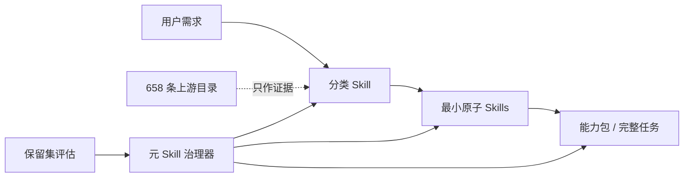

# 可自组织的 Skills

[English](README.md) · **研究型 Alpha 版本**

这是一个兼容 Codex 的原子化、可组合、可评估、可安全自进化的 Agent Skill 操作系统。

它没有把网上所有 Skill 一股脑安装进上下文，而是把生态分成四层：



上游目录只为分类、拆分和组合提供证据；只有经过本仓库审查并声明能力契约的内容，才进入可执行 Skill 层。

## 首版包含什么

| 层级 | 当前数量 | 作用 |
| --- | ---: | --- |
| 分类 Skills | 10 | 第一阶段按真实需求分类，并处理领域边界 |
| 原子 Skills | 11 | 小而独立、可测试、可替换的能力契约 |
| 元 Skills | 1 | 管理提案、评估、晋级、弃用与回滚，也约束自身 |
| 能力包 | 4 | 不合并原子的前提下，组成端到端任务 |
| 上游记录 | 658 | 388 个 Agent Skills + 270 个官方 MCP Registry 服务 |
| 疑似重复簇 | 8 | 进入人工审查队列，不自动删除来源 |

每个分类投影同时提供 `index.en.md`、`index.zh-CN.md` 和通用回退 `index.zh.md`。英文 `SKILL.md` 保持跨工具发现兼容性，本地化索引则保留不同语言的表达和路由习惯。

## 我采纳并固化的设计原则

- **先需求、后工具。** 先判断目标结果、产物、操作和约束，再选择具体产品或协议。
- **一个原子一个主要能力。** 稳定能力 ID，加上输入、输出、副作用、权限、非目标和测试，使重叠可计算、可审查。
- **渐进式读取。** Codex 先看到精简元数据，再命中分类索引，最后只加载完成任务所需的原子 Skill。
- **插件式架构。** 仓库本身是一个插件包，包含清单、两种 Skill 投影、Schema、能力包和评估资产。
- **证据门禁下的进化。** 元 Skill 可以修改自己，但不能在同一个提案中削弱自己的门禁；保留测试集、权限审批、追加式决策记录和回滚指针不受优化目标控制。
- **被收录不等于可信。** 采集过程不执行上游代码；许可未知的条目只保存元数据，安装前必须另行安全审查。

架构参考当前的 [OpenAI Agent Skills 文档](https://learn.chatgpt.com/docs/build-skills)、[Codex 插件文档](https://learn.chatgpt.com/docs/build-plugins)和[官方 MCP Registry API](https://github.com/modelcontextprotocol/registry/blob/main/docs/reference/api/official-registry-api.md)。

## 快速开始

需要 Node.js 24 或更新版本，以及 Git。

```sh
git clone https://github.com/WnagoiYy/self-organizing-skills.git
cd self-organizing-skills
npm ci
npm run ci
```

体验可解释路由和状态检查：

```sh
npm run sos -- route "请调研三家竞争对手并输出带引用的中文报告"
npm run sos -- catalog stats
npm run sos -- packs
npm run sos -- harness status
```

若要以 Codex 项目级 Skill 使用，请把本仓库 `.agents/skills/` 下经过审查的目录复制到目标仓库的 `.agents/skills/`。插件包和兼容 Harness 使用 `skills/`。二者都由 `skill-src/` 生成，请勿直接编辑投影目录。

## 目录结构

```text
.codex-plugin/        Codex 插件清单
.agents/skills/       生成的 Codex 项目级投影
skills/               生成的插件/Harness 投影
skill-src/            分类、原子与元 Skill 的唯一源文件
taxonomy/             分类标准与边界
catalog/              有来源、未执行的上游元数据
packs/                可组合能力包
schemas/              机器可读能力契约
evals/                分集问题集、门槛与基线
.skill-system/        进化提案与追加式决策记录
src/                  路由、校验、采集、评估、训练和 Harness
```

## 测试与真实进化证据

`npm run sos -- gate` 分别评估分类命中、原子命中、MRR、不调用准确率和安全通过率，不用一个总分掩盖短板。英文、中文、对抗问题集彼此独立；任务完成率另行评估，不能用路由正确率代替。

仓库已经保存一次真实的受治理进化：`proposal-generic-zh-fallback`。该候选增加了 `index.zh.md`，依次通过开发集、未参与生成的英文/中文测试集和对抗集，并写入带回滚版本的不可覆盖晋级记录。

Pi 0.84.4 已固定版本，并通过其真实 `loadSkillsFromDir` 发现全部 22 个 Skill。由于本机尚未配置 Pi 模型提供商凭证，模型驱动的任务完成率仍明确标记为**未认证**。Mock 只验证协议管线，结果始终带 `synthetic: true`；DeepSeek Harness 需等兼容 CLI 版本固定后才启用。

详细说明见[评估流程](docs/zh-CN/evaluation.md)、[Harness 适配](docs/zh-CN/harnesses.md)和[进化策略](docs/zh-CN/evolution-policy.md)。

## 刷新 300+ 来源目录

```sh
npm run sos -- catalog collect
npm run sos -- catalog deduplicate
npm run sos -- catalog stats
```

采集固定 Git 版本并读取官方 MCP Registry 的只读接口，保存来源、归属和指纹；不会运行包、Hook、端点或 Skill 指令。修改来源前请阅读[目录方法](docs/zh-CN/catalog-methodology.md)和[第三方说明](THIRD_PARTY.md)。

## 后续演进

- 从真实失败中扩充多语言保留路由集和可执行任务集。
- 引入语义级重复审查，但不把相似度直接等同于自动删除。
- 为固定的 Pi 模型/提供商组合建立真实任务完成率基线。
- 固定可兼容的 DeepSeek Harness 版本并完成适配。
- 增加签名快照、信任等级晋升、灰度发布和更丰富的回滚遥测。

贡献方式见 [CONTRIBUTING.md](CONTRIBUTING.md)，安全问题见 [SECURITY.md](SECURITY.md)。项目采用 Apache-2.0 许可证。
