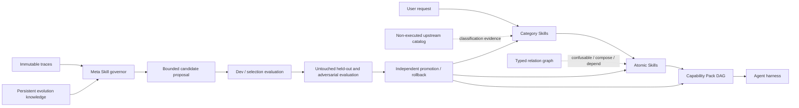

# SkillPack One: A Portable Control Plane for Self-Organizing, Composable, and Governed Agent Skills

**Anonymous system paper draft — 2026-09-02**

## Abstract

Reusable Agent Skills package procedural knowledge as discoverable files, but a growing ecosystem creates four systems problems: large catalogs become difficult to route, overlapping capabilities become difficult to compose, community artifacts cross several trust boundaries, and self-modification can silently optimize against its own evidence. This paper presents **SkillPack One**, a portable control plane for self-organizing Agent Skills. The design separates Category Skills for progressive routing, Atomic Skills with explicit responsibility and permission boundaries, Capability Packs that compile reviewed partial orders into executable plans, and Meta Skills that govern proposal, evaluation, promotion, rollback, and learning. All first-party capabilities share a machine-readable contract; locale-specific indexes preserve language-specific routing while stable identifiers remain portable. The system keeps immutable traces, persistent evolution knowledge, active Skills, and bounded within-run state as distinct artifacts. Recent retrieval, realistic-use, security, relation-graph, and text-optimization research is incorporated through equivalence-aware multi-Skill metrics, same-domain hard distractors, six-stage lifecycle security reviews, reviewed typed relations, and strictly improving bounded evolution attempts. The reference implementation contains 100 Skill contracts, four Capability Packs, a non-executed catalog of 658 Skill/MCP records, and a broader fingerprinted inventory of 3,998 downloaded Skill records. One hundred eighty-six deterministic routing examples pass the current gate, including multilingual, adversarial, and hard-distractor suites. These results validate implementation invariants, not general model utility; the paper therefore specifies a separate model-backed experimental protocol based on paired no-Skill/with-Skill task effect. SkillPack One's central contribution is an interchangeable governance contract: learned routers and optimizers may evolve, while authorization, evidence separation, and rollback remain stable.

**Keywords:** Agent Skills, capability routing, skill composition, self-improving agents, lifecycle security, progressive disclosure, agent governance

## 1. Introduction

Agent Skills have emerged as a lightweight adaptation layer between general-purpose language models and task-specific execution. A Skill can bundle instructions, scripts, references, and resources in a discoverable directory without changing model weights [1]. This mechanism is attractive because the artifact is portable, inspectable, and cheap to deploy. It also moves complexity out of the model and into a fast-growing capability ecosystem.

Scale changes the problem. A system with ten Skills can expose their names directly; a system with tens of thousands must retrieve a small relevant subset. Public repositories contain functional overlap, inconsistent metadata, different permission needs, and untrusted instructions. Complex tasks require more than one Skill, so the system must predict a subset, count, order, and dependency structure. Finally, a self-improving Skill library risks training on its own test evidence, preserving accidental rules, expanding authority, and losing a known-good rollback state.

Existing research has developed strong methods for individual parts of this problem. SkillsBench evaluates whether curated Skills improve downstream tasks [2]. SkillRet and SkillRouter study retrieval at realistic catalog scale [3, 4]. Realistic-use experiments separate Skill availability, selection, retrieval, loading, adaptation, and task completion [5]. SkillWeaver and SkillComposer address decomposition and structured composition [6, 7]. SkillNet organizes Skills with taxonomy, relations, and packages [8]. SkillOpt, WikiSkill, and related evolution systems turn trajectories into persistent or optimized procedural artifacts [9, 10]. SKILL.state separates current execution state from long interaction history [11]. Skill security research exposes supply-chain and lifecycle threats [12, 13].

These advances leave an integration question: **what portable control plane allows different retrieval, composition, execution, and evolution implementations to interoperate without making any one learned backend the source of authorization?**

SkillPack One addresses this question with four contributions:

1. a shared Atomic Skill contract that makes outcome, boundary, permission, provenance, routing, and evaluation fields machine-readable;
2. a progressive Category -> Atom -> Capability Pack architecture that keeps routing and composition explicit while supporting locale-specific indexes;
3. an evidence-gated Meta Skill protocol that separates optimizer state, persistent knowledge, active capabilities, held-out evidence, and rollback;
4. a reference implementation and evaluation protocol that reports routing, complete multi-Skill recovery, downstream Skill effect, and lifecycle security as separate measurements.

The contribution is a systems architecture and reference implementation, not a claim that one taxonomy, lexical router, or optimizer is universally optimal.

## 2. Design Requirements

SkillPack One begins from six requirements derived from the intended deployment model and the literature.

**R1 — One installation, progressive context.** “One pack” means one installation and governance entry point, not one giant prompt. A broad catalog must remain available without loading every Skill body into the active context.

**R2 — Atomic responsibility.** An Atomic Skill owns one primary outcome, dominant artifact or state transition, permission envelope, focused rubric, and useful failure boundary. Workflows compose Atoms rather than widening them.

**R3 — Taxonomy is replaceable, contracts are portable.** Organizations may classify industries or functions differently. Interoperability depends on shared descriptions, stable identifiers, explicit boundaries, and evidence rather than a universal directory tree.

**R4 — Generation is not admission.** Human authors and models may generate Skills, but a proposal does not become active until provenance, security, held-out evaluation, and independent review pass.

**R5 — Skill presence is not Skill utility.** Routing accuracy, load rate, and a syntactically valid Skill do not establish downstream benefit [2, 5]. Task claims require paired runs under a pinned model and harness.

**R6 — Self-improvement is reversible.** Every accepted modification must preserve the evidence that motivated it, the candidate diff, protected metrics, approval identity, canary scope, and tested rollback pointer.

## 3. Related Work

### 3.1 Skill effectiveness and realistic use

SkillsBench compares no-Skill, curated-Skill, and self-generated-Skill conditions across diverse tasks [2]. It motivates paired Skill-effect measurement and warns that fluent self-generation is not equivalent to improvement. Liu et al. move from idealized conditions toward large-pool retrieval and general-purpose Skills [5]. Their progressive settings reveal distinct failures in selection, retrieval, loading, adaptation, and use. SkillPack One therefore keeps task completion, routing, and Skill usage as different result families.

### 3.2 Retrieval and composition

SkillRet frames retrieval as long-document matching and reports Recall and strict completeness for multi-Skill requests; it also audits functionally equivalent Skills to reduce false negatives [3]. SkillRouter finds that Skill bodies contain routing information absent from raw names and descriptions and shows the value of hard negatives, false-negative filtering, and listwise reranking [4]. SkillWeaver decomposes complex requests, retrieves Skills per subtask, and constructs a dependency-aware plan [6]. SkillComposer treats subset, number, and order as one constrained sequence problem [7]. SkillPack One does not reproduce these learned models. Instead, it defines a common output contract and deterministic baseline against which a learned backend must be evaluated.

### 3.3 Skill organization and evolution

SkillNet separates taxonomy, typed relations, and packaged collections, with multi-dimensional quality assessment [8]. Trace2Skill consolidates lessons from multiple trajectories [15], while AutoSkill and SkillX study ongoing experience-driven construction and knowledge bases [16, 17]. Voyager provides an earlier example of an accumulating executable skill library in an open-ended environment [18]. WikiSkill separates traces, persistent consolidated knowledge, and active Skills [10]. SkillOpt adds bounded text edits, strict validation selection, rejected-edit feedback, and optimizer-only meta state [9]. SkillPack One adopts these as control-plane invariants while leaving the proposal generator interchangeable.

### 3.4 State and security

SKILL.state executes long procedures using an immutable specification, bounded current state, and the latest observation [11]. SkillPack One uses this as an opt-in Capability Pack profile, not a universal transcript replacement. Skill-Inject shows that Skill files form a supply-chain attack surface [13]. Agent Skill Security extends the threat model across authoring, storage, retrieval, selection, execution, and evolution [12]. The reference implementation represents all six stages explicitly and treats updates as new admissions.

## 4. System Architecture

### 4.1 Shared capability contract

Every first-party Category, Atomic, and Meta Skill has a portable `SKILL.md` and a machine-readable `skill.contract.yaml`. The contract records:

- stable identity, version, kind, localized name, and summary;
- outcomes, artifacts, typed inputs and outputs;
- preconditions, failures, side effects, and permission envelope;
- primary and secondary taxonomy locations, lifecycle phases, modalities, dependencies, and risk;
- localized positive and negative routing triggers plus explicitly confusable capabilities;
- provenance, license, derivation, and evaluation identifiers.

The contract does not attempt to encode the entire Skill body. It exposes the fields needed for routing, composition, governance, and review while retaining `SKILL.md` as the human- and agent-readable procedural artifact.

### 4.2 Category routing and localization

A request first selects a Category Skill, reads the locale-appropriate category index, and then loads only the selected Atom. The reference taxonomy recommends no more than three Category levels; the Atom is the leaf. Executable Skill directories remain flat for host discovery, while hierarchy is represented by taxonomy parents and generated indexes.

The portable discovery file remains English. Category indexes provide `index.md`, `index.en.md`, `index.zh-CN.md`, and generic `index.zh.md` variants. Stable capability identifiers remain language-independent. This design lets a locale refine vocabulary and negative boundaries without forking the underlying capability.

The baseline router is deterministic and explanation-producing. It reports matched positive signals, applied penalties, ranked Categories, ranked Atoms, Meta Skills, and ambiguity. An optional learned router may use body-aware offline features, but it must emit the same trace shape and may not silently expand permissions or activate an unreviewed capability.

### 4.3 Atomic Skills, Capability Packs, and typed relations

A Capability Pack names a reviewed set of stable Atom and Meta Skill identifiers, optional MCP dependencies, partial-order constraints, and acceptance tests. The compiler turns the partial order into deterministic stages. This avoids creating a new monolithic Skill for every workflow.

The typed relation graph supplements the taxonomy with four evidence-bearing relations:

- `confusable-with`, declared by a Skill contract;
- `packaged-in`, declared by a reviewed Capability Pack;
- `compose-with`, derived from reviewed co-membership;
- `depends-on`, derived from a pack's directed ordering.

Relations cannot authorize execution or deletion. Unknown endpoints, invalid self-relations, missing evidence, duplicate edges, and dependency cycles fail validation.

### 4.4 Lifecycle security

Each reusable capability has a lifecycle review with six independent stages. Authoring checks consistency among advertised behavior, instructions, and authority. Storage checks origin, integrity, version lineage, and dependencies. Retrieval checks manipulation and duplicate flooding. Selection checks planner-visible metadata and permission consistency. Execution checks actual operations and information flow. Evolution checks whether an update changes behavior, dependencies, provenance, or permission.

Each stage records reviewed threats, evidence, status, and residual risk. An applicable stage cannot pass without evidence. `not-applicable` requires a rationale. A semantic review never substitutes for runtime enforcement.

### 4.5 Governed evolution

Evolution has four distinct stores:

1. immutable task traces and run artifacts;
2. persistent Evolution Knowledge containing recurring, scoped, evidence-linked patterns;
3. append-only bounded evolution attempts;
4. active, promoted Skills and Capability Packs.

An optimizer attempt may apply only explicit `add`, `delete`, or `replace` edits within a proposal and an edit budget. Training evidence proposes changes; a separate selection split accepts only strict improvement. Ties are rejected. Any protected regression rejects the attempt. Rejected edits and score changes remain evidence so later optimization does not repeat them. Optimizer-only summaries may guide later proposals but are not shipped inside an Atomic Skill.

Promotion requires an independent reviewer, an append-only decision, a canary scope, and a rollback revision. A Meta Skill proposal cannot weaken its own gate, replace its held-out set, erase its audit history, or remove its rollback path.

### 4.6 Long-horizon state

Capability Packs may opt into a JSON-Schema-validated current-state profile with JSON Merge Patch semantics and an external audit log. This profile is appropriate only when the current state is a sufficient statistic for future action. Transcript mode remains valid when history itself is the task, when a summary would erase authority-relevant evidence, or when concurrent actors make state reconciliation unsafe.

## 5. Reference Implementation

SkillPack One is implemented in TypeScript and distributed as a Codex-compatible plugin and npm package. Canonical Skills live in `skill-src/`; generated projections are emitted under `skills/` and `.agents/skills/`. The package includes JSON Schemas, a deterministic router, Capability Pack compiler, harness adapters, catalog collection, evaluation and effect measurement, governed proposal tooling, Evolution Knowledge, runtime-state validation, lifecycle security review, and typed relation construction.

The current snapshot contains:

| Artifact | Count | Role |
| --- | ---: | --- |
| Category Skills | 22 | open hierarchical needs and boundary routing |
| Atomic Skills | 76 | independently testable capability contracts |
| Meta Skills | 2 | upstream curation and governed lifecycle change |
| Capability Packs | 4 | reviewed composition and ordering |
| Upstream catalog records | 658 | attributed, non-executed classification evidence |
| Downloaded Skill records / unique contents | 3,998 / 3,973 | fingerprinted, non-executed design evidence |
| Typed relation nodes / edges | 104 / 166 | reviewed confusion, composition, dependency, packaging |

Of the 658 normalized upstream records, 388 are Agent Skills and 270 are official MCP Registry server records. The broader inventory spans 41 declared repositories, flags 25 exact-content duplicates, and leaves unmatched records in a manual-review family. Problem solving, scientific research, software development, and software use are seed examples within an open taxonomy rather than an exhaustive partition. Unknown or detected license status remains metadata; collection does not authorize execution.

## 6. Evaluation

### 6.1 Questions and metrics

The current engineering evaluation asks:

- **Q1:** Do public artifacts satisfy schemas and repository invariants?
- **Q2:** Does the deterministic baseline preserve Category and Atom boundaries across English, Chinese, adversarial, and hard-distractor requests?
- **Q3:** Do the new control-plane gates reject incomplete multi-Atom recovery, malformed lifecycle reviews, dependency cycles, and unsafe evolution attempts?

Routing metrics are reported separately: Category Hit@1/3, Atom Hit@1/3, Atom MRR, Atom Recall@3, Atom Full Coverage@3, non-invocation accuracy, and safety pass rate. For a multi-Atom query, Recall@3 measures the fraction of required capability groups represented in the top three; Full Coverage@3 is one only when every group is represented. Reviewed functional alternatives may inhabit the same group.

Task utility is a different experiment. Matched no-Skill and with-Skill runs compare completion, rubric pass, blocking, latency, and cost under the same dataset, harness, and model. Synthetic Mock runs test protocol plumbing and are non-certifying.

### 6.2 Deterministic conformance result

The candidate was evaluated on 186 routing examples:

| Suite | Split | Locale | Examples | Category H@1 | Atom H@1 | Recall@3 | Full Coverage@3 | Safety |
| --- | --- | --- | ---: | ---: | ---: | ---: | ---: | ---: |
| routing-adversarial | adversarial, protected | en | 8 | 1.00 | 1.00 | 1.00 | 1.00 | 1.00 |
| routing-bootstrap | development | en | 3 | 1.00 | 1.00 | 1.00 | 1.00 | 1.00 |
| routing-en-test | test | en | 10 | 1.00 | 1.00 | 1.00 | 1.00 | 1.00 |
| routing-hard-distractors | development | en | 4 | 1.00 | 1.00 | 1.00 | 1.00 | 1.00 |
| routing-library-adversarial | development, adversarial cases | en | 21 | 1.00 | 1.00 | 1.00 | 1.00 | 1.00 |
| routing-library-en | development, candidate-authored | en | 65 | 1.00 | 1.00 | 1.00 | 1.00 | 1.00 |
| routing-library-zh-cn | development, candidate-authored | zh-CN | 65 | 1.00 | 1.00 | 1.00 | 1.00 | 1.00 |
| routing-zh-cn-test | test | zh-CN | 10 | 1.00 | 1.00 | 1.00 | 1.00 | 1.00 |

The hard-distractor development suite initially exposed a practical failure: negated phrases such as “do not edit the source” could still score as positive edit signals, while generic words such as “evidence” could dominate a security request. A later expansion test exposed the related elliptical forms “do not translate it” and “do not generate a new scene.” Negation-aware action matching, narrower outcome boundaries, and added conversational triggers raised all current development-suite metrics to 1.00. This is a test-driven debugging observation, not held-out evidence of generalization.

Focused tests also verify that functional alternatives receive credit, partial multi-Atom recovery does not pass Full Coverage, lifecycle stages fail closed, declared evolution decisions must agree with measured evidence, and dependency cycles are rejected. The complete repository test suite is the reproducibility boundary for these engineering claims.

### 6.3 What the result does not show

The examples are small, authored for this repository, and partly used during development. A score of 1.00 therefore does not establish large-scale retrieval performance, cross-model Skill use, or downstream task lift. The deterministic router has not been compared with SkillRet- or SkillRouter-style learned retrieval over the complete upstream corpus. Live Pi task-effect certification also requires provider credentials and a pinned model. No claim in this paper transfers the numerical gains of cited systems to SkillPack One.

## 7. Model-Backed Experimental Protocol

A publication-ready empirical study should add four experiments without changing the control-plane contract.

**E1 — Retrieval scale and overlap.** Compare deterministic lexical routing, hybrid sparse/dense retrieval, body-distilled metadata, and body-aware retrieve-rerank over increasing catalog sizes. Report Hit, MRR, Recall, Full Coverage, latency, and cost. Audit functional equivalents before treating close candidates as negatives.

**E2 — Progressive realism.** Evaluate forced curated Skills, autonomous curated Skills, curated Skills with distractors, retrieval with curated Skills present, retrieval without curated Skills, query-specific refinement, and no Skills. Record availability, retrieval, loading, use, and task completion separately.

**E3 — Bounded optimizer ablation.** Compare unrestricted rewrite, bounded edits, bounded edits plus strict selection, rejected-attempt memory, and optimizer-only slow/meta state. Hold the target model and harness fixed. Use train data for proposal, a selection split for acceptance, and untouched test data for reporting.

**E4 — Lifecycle security.** Measure malicious admission, retrieval attack success, malicious planner selection, execution policy violations, and malicious update detection at their corresponding boundaries. Include developer-friction measures such as false positive rate. No aggregate security score should hide a failed stage.

All model-backed experiments should publish dataset and registry digests, Skill revision, harness and model versions, prompt/load policy, random seeds or repeated trials, cost, latency, and rejected results.

## 8. Discussion

### 8.1 Why the control plane stays deterministic

The portable baseline is intentionally simpler than the best learned retrieval systems. Determinism supports debugging, offline installation, small private repositories, and a stable reference for regression. It also prevents a model score from becoming an authorization decision. A learned router is still desirable at large scale, especially when body-resident signals matter [3, 4]. SkillPack One treats it as a replaceable data-plane backend governed by common evidence and safety gates.

### 8.2 Why a Category Skill is not merely a folder

A Category Skill contains inclusion, exclusion, language-specific terminology, and an index of certified Atoms. It is a decision boundary: broad enough to reduce search space, but not an executable catch-all. This makes category errors observable and lets organizations replace the taxonomy without rewriting every Atom contract.

### 8.3 Why self-evolution remains externally governed

Self-evolution systems can accumulate useful procedures [9, 10, 14–17], but the ability to propose an edit does not confer authority to approve it. Separating proposer, evaluator, protected data, reviewer, and deployed artifact reduces self-confirmation. Preserving rejected attempts is equally important: negative evidence prevents repeated exploration without contaminating ordinary task context.

## 9. Limitations and Threats to Validity

The implementation is an early research-grade alpha. Its first-party Skill set is deliberately small, and the upstream catalog is metadata rather than executable coverage. The authored routing suites are insufficient to estimate real-user distributions. The Chinese suite tests one locale and does not establish general multilingual performance. The relation graph materializes declared evidence but does not discover missing relations. Lifecycle review validates record completeness and deterministic gates; it cannot prove that an LLM-based semantic reviewer or runtime taint tracker is sound. Capability Packs encode reviewed plans but do not yet learn new compositions from protected data. Current model-backed Harness results are not certified, and no statistical significance claim is made.

The literature base is unusually recent and contains many preprints. Findings may change under peer review, broader replications, different model generations, or different agent harnesses. For this reason, the architecture adopts narrow invariants—separation, evidence, strict improvement, least authority, and rollback—rather than paper-specific implementations.

## 10. Conclusion

Skill ecosystems need more than package discovery. They need a portable contract for deciding what a Skill is responsible for, how it composes, which evidence supports it, what authority it needs, and how it can change without certifying itself. SkillPack One provides that contract through Category Skills, Atomic Skills, Capability Packs, and Meta governance. The reference implementation integrates equivalence-aware retrieval evaluation, lifecycle security, typed relations, persistent evolution knowledge, bounded long-horizon state, and strictly improving evolution attempts while remaining compatible with a single-installation Skill package.

The intended future is not one universal taxonomy or one permanent router. It is a stable, auditable control plane under which different communities and models can discover, combine, test, and improve Skills without losing provenance, safety boundaries, or rollback.

## References

[1] OpenAI, “Agent Skills,” 2026. https://learn.chatgpt.com/docs/build-skills

[2] X. Li et al., “SkillsBench: Benchmarking How Well Agent Skills Work Across Diverse Tasks,” arXiv:2602.12670, 2026.

[3] R. Kang, H. Cho, and Y. Kim, “SkillRet: A Large-Scale Benchmark for Skill Retrieval in LLM Agents,” arXiv:2605.05726, 2026.

[4] Y. Zheng et al., “SkillRouter: Skill Routing for LLM Agents at Scale,” arXiv:2603.22455, 2026.

[5] Y. Liu et al., “How Well Do Agentic Skills Work in the Wild: Benchmarking LLM Skill Usage in Realistic Settings,” arXiv:2604.04323, 2026.

[6] X. Gao, “Compositional Skill Routing for LLM Agents: Decompose, Retrieve, and Compose,” arXiv:2606.18051, 2026.

[7] X. Zhao et al., “Generative Skill Composition for LLM Agents,” arXiv:2606.32025, 2026.

[8] Y. Liang et al., “SkillNet: Create, Evaluate, and Connect AI Skills,” arXiv:2603.04448, 2026.

[9] Y. Yang et al., “SkillOpt: Executive Strategy for Self-Evolving Agent Skills,” arXiv:2605.23904, 2026.

[10] L. Tang et al., “WikiSkill: Compiling Agent Experience into Persistent Knowledge for Skill Evolution,” arXiv:2608.27454, 2026.

[11] S. Badhe, P. Tiwari, and J. Chung, “SKILL.state: Scalable Long-Horizon Agent Skills,” arXiv:2608.26263, 2026.

[12] S. Badhe and P. Tiwari, “Agent Skill Security: Threat Models, Attacks, Defenses, and Evaluation,” arXiv:2607.13987, 2026.

[13] D. Schmotz, L. Beurer-Kellner, S. Abdelnabi, and M. Andriushchenko, “Skill-Inject: Measuring Agent Vulnerability to Skill File Attacks,” arXiv:2602.20156, 2026.

[14] H. Zhang et al., “CoEvoSkills: Self-Evolving Agent Skills via Co-Evolutionary Verification,” arXiv:2604.01687, 2026.

[15] J. Ni et al., “Trace2Skill: Distill Trajectory-Local Lessons into Transferable Agent Skills,” arXiv:2603.25158, 2026.

[16] Y. Yang et al., “AutoSkill: Experience-Driven Lifelong Learning via Skill Self-Evolution,” arXiv:2603.01145, 2026.

[17] C. Wang et al., “SkillX: Automatically Constructing Skill Knowledge Bases for Agents,” arXiv:2604.04804, 2026.

[18] G. Wang et al., “Voyager: An Open-Ended Embodied Agent with Large Language Models,” arXiv:2305.16291, 2023.
