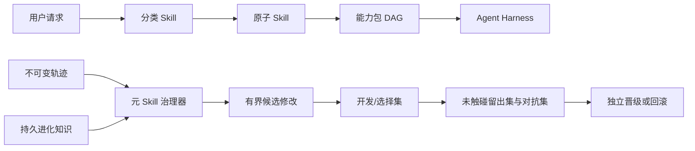

# SkillPack One：面向自组织、可组合和受治理 Agent Skill 的可移植控制平面

**中文扩展摘要 — 修订于 2026-09-03**

## 摘要

Agent Skill 通过可发现的目录封装过程知识，但 Skill 规模增长以后会产生四类系统问题：大目录难以准确检索，重叠能力难以组合，社区产物跨越多个安全信任边界，自修改则可能对自己的证据过拟合并失去回滚路径。本文提出 **SkillPack One**：一个面向自组织 Agent Skill 的可移植控制平面。系统将能力分为负责渐进路由的 Category Skill、职责与权限边界明确的 Atomic Skill、把已审查偏序编译成执行计划的 Capability Pack，以及治理提案、评测、晋级、回滚和学习的 Meta Skill。所有第一方能力遵循统一机器可读契约；不同语言可以拥有本地化索引，而稳定能力 ID 保持不变。系统进一步分离原始轨迹、持久进化知识、活动 Skill 和单次长任务状态。

本轮吸收 SkillRet、SkillRouter、真实环境 Skill 评测、Agent Skill Security、SkillNet、SkillOpt 以及前沿 Skill Creator 的关键机制，增加等价感知的多 Skill Recall/Full Coverage、独立元 Skill 路由指标、同领域硬干扰、安全生命周期六阶段审查、类型化 Skill 关系，以及只接受严格提升的有界进化尝试。参考实现包含 106 个 Skill 契约、4 个能力包、658 条不执行的规范化 Skill/MCP 元数据，以及 3,998 条更广的已下载 Skill 指纹清单。当前 202 条确定性路由样例全部通过，但这些结果只验证工程不变量，不证明真实模型任务增益。本文因此另外提出基于固定模型/Harness 的 no-Skill/with-Skill 成对实验协议。

## 核心研究问题

现有论文分别研究了检索、组合、进化、状态和安全，但工程系统仍需要回答：**能否建立一种稳定控制平面，让不同检索器、组合器、Harness 和优化器可以替换，同时不把任何学习模型的分数直接变成授权？**

SkillPack One 的回答是四层架构：

1. Category Skill 先判断用户真正需要的结果、产物和风险边界；
2. Atomic Skill 只拥有一个主要结果和一个独立可测试的职责边界；
3. Capability Pack 组合稳定 Atom ID、依赖顺序和验收测试；
4. Meta Skill 只负责生命周期变化，不直接替代普通领域能力。

## 系统设计

统一契约包含稳定 ID、版本、类型、多语言名称、结果、产物、输入输出、前置条件、失败、权限、风险、正负触发、易混淆能力、来源与评测。`SKILL.md` 继续承载人和 Agent 可读的过程指令，契约只暴露检索、组合和治理所需的公共字段。

分类目录建议不超过三层。英文 `SKILL.md` 作为可移植发现入口，分类索引可以提供 `index.md`、`index.en.md`、`index.zh-CN.md` 和通用 `index.zh.md`。语言版本可以调整表达习惯和负边界，但不改变 Atom ID。

能力包不把多个 Atom 合成巨型 Skill，而是声明 Atom 集、可选 MCP、依赖偏序和验收测试。类型化关系图只物化已有证据：契约声明 `confusable-with`，能力包产生 `packaged-in`、`compose-with` 和 `depends-on`。关系相似不能授权安装、执行、合并或删除。

## 受治理进化

进化流程分为四类数据：不可变任务轨迹、跨迭代进化知识、有界 evolution attempt、已晋级活动 Skill。每个优化步骤只能在预算内执行显式 `add`、`delete` 或 `replace`；训练数据只能推动提案，选择集必须严格提升，平分也拒绝；任何受保护指标回退都拒绝。失败编辑与分数变化仍保留，以避免重复失败，但优化器专属记忆不能进入普通 Atom 上下文。

晋级要求生成者之外的独立审核者、只追加决定、灰度范围和回滚 revision。Meta Skill 修改自己时也不能更换留出集、删除审计或弱化自身闸门。

## 生命周期安全

安全审查分为创作、存储、检索、选择、执行和进化六阶段。每个阶段记录信任假设、已检查威胁、证据、状态和残余风险。适用阶段没有证据就不能通过；`not-applicable` 必须解释。签名只能说明来源和完整性，语义审查只能说明一定程度的一致性，二者都不能替代运行时最小权限和信息流控制。任何更新都重新进入准入，而不是继承旧版本信任。

## 当前工程结果

候选实现包含 22 个 Category、76 个 Atom、8 个 Meta Skill、4 个能力包、110 个关系节点和 185 条有证据关系。8 个元职责分别是上游策展、创作、只读质量审计、行为评测、有界优化、宿主兼容迁移、能力包组合和最终生命周期治理，避免同一角色同时编写、评分并批准自身变更。非执行规范化上游目录共有 658 条记录，其中 388 条 Agent Skill、270 条 MCP Server；更广的下载清单包含 3,998 条记录、3,973 份独立内容和 25 个完全重复项。问题研究、科学研究、软件开发和软件使用只是开放 taxonomy 的种子示例，并非封闭四分法。

确定性路由在 202 条仓库样例上通过当前闸门，样例包括英文、简体中文、元 Skill、对抗和同领域硬干扰。指标分别报告 Category Hit@1/3、Atom Hit@1/3、MRR、Recall@3、Full Coverage@3、特殊元 Skill Hit@1/3 与 MRR、非调用准确率与安全通过率，不汇总成一个总分。

硬干扰开发集最初发现两个真实问题：否定语句“不要编辑源码”仍可能触发编辑 Atom，通用词 “evidence/source” 可能压过安全任务的真正结果边界。修复否定作用域与职责词以后，该四条开发集的 Category Hit@1、Atom Hit@1 和 Safety 从 0.50 提升到 1.00。该数字是测试驱动调试记录，不是留出集泛化结论。

## 后续正式实验

正式论文需要继续完成四组模型实验：

1. 在不同目录规模下比较确定性、稀疏/稠密混合、正文摘要和正文感知重排；
2. 分别测试强制精选 Skill、自主选择、干扰项、检索、无精选 Skill 的适配、任务特定改写和无 Skill；
3. 对无约束重写、有界编辑、严格选择、失败缓存和慢速/元更新做消融；
4. 分阶段测试恶意准入、检索操纵、Planner 欺骗、执行违规和恶意更新，并同时报告误报成本。

所有实验都应记录数据集与目录摘要、Skill revision、模型、Harness、加载策略、重复试验、成本、延迟和失败结果。

## 局限

项目仍是研究级 alpha。76 个第一方 Atom 仍不足以覆盖真实世界能力长尾，上游目录只是元数据而非已安装能力；当前人工样例不足以估计真实用户分布；中文测试不能代表普遍多语言能力；关系图只能物化已声明关系；安全 Schema 只能验证记录和确定性门禁，不能证明模型 Judge 或运行时 Taint Tracking 正确；当前还没有可认证的真实 Harness Skill Lift。

因此，本文的主要贡献不是“效果最好的路由器”，而是一种可替换实现、不可绕过证据与授权边界的控制平面。完整英文论文及参考文献见 [`skillpack-one.md`](skillpack-one.md)。
